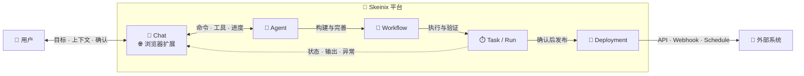

<p align="center">
  <picture>
    <source media="(prefers-color-scheme: dark)" srcset="web/public/branding/icon-dark.png">
    <source media="(prefers-color-scheme: light)" srcset="web/public/branding/icon-light.png">
    
  </picture>
</p>

<h1 align="center">Skeinix</h1>

<p align="center">
  <strong>用 AI Agent、可视化工作流、任务和浏览器，在一个平台完成构建、预览、自动化与部署。</strong>
</p>

<p align="center">
  一个用于构建、运行和发布 AI 辅助自动化流程的自托管平台。
</p>

<p align="center">
  <a href="https://github.com/LYuhang/Skeinix/actions/workflows/ci.yml"></a>
  <a href="https://github.com/LYuhang/Skeinix/actions/workflows/security.yml"></a>
  <a href="LICENSE"></a>
  
  
  
</p>

<p align="center">
  <a href="README.md">English</a> · 简体中文
</p>

<p align="center">
  <a href="#项目简介">项目简介</a> ·
  <a href="#快速开始">快速开始</a> ·
  <a href="#使用说明">使用说明</a> ·
  <a href="#系统架构">系统架构</a> ·
  <a href="#文档">文档</a> ·
  <a href="SECURITY.md">安全</a> ·
  <a href="CONTRIBUTING.md">参与贡献</a>
</p>

> [!IMPORTANT]
> Skeinix 目前处于 Alpha 阶段。Agent、工作流、存储、权限控制、部署和沙盒等核心服务已经实现，但 API 与数据模型在首个稳定版本发布前仍可能调整。浏览器自动化功能尚处于实验阶段。

## 项目简介

Skeinix 是一个将 Agent 对话转化为可执行工作流的开源平台。只需在 Chat 中描述目标，Agent 就会直接构建或修改可视化画布中的工作流图，而不是另外生成一份与实际执行脱节的建议或示意图。工作流的结构、版本、运行记录、输出和异常信息在整个过程中始终可见。

工作流通过验证后，可以按需运行、批量执行或设置定时任务，也可以发布为 API 或 Webhook。Agent 与工作流的执行环境通过沙盒服务与控制平面隔离。

### Skeinix 的工作方式

```text
描述目标
   ↓
在 Chat 中构建或修改工作流
   ↓
在可视化画布中检查并完善工作流图
   ↓
在隔离沙盒中运行和验证
   ↓
复用工作流，或将其发布为自动化服务
```

Skeinix 的核心特点：

- 🪄 **由 Agent 直接构建工作流**：Agent 编辑并验证真实的工作流图，避免方案描述与实际执行逻辑相互脱节。
- 🔎 **从目标到结果全程可见**：计划、节点、版本、运行记录、输出和异常均可在 Chat 与画布中检查。
- ♻️ **将一次性任务转化为可复用自动化**：把 Agent 完成的临时工作沉淀为可持久化、可版本管理、可再次运行或发布的工作流。
- 🧩 **可扩展的 Agent 能力**：支持 LangChain 或 Codex，并可组合 MCP 服务、Skills、知识库、SubAgent 和浏览器控制能力。
- 🛡️ **自托管与隔离执行**：模型与数据由部署方掌控，Agent 与 Workflow 的代码执行统一进入隔离沙盒。

## 快速开始

### 安装

#### Docker Compose（推荐）

安装 Docker Engine，或安装包含 Compose v2 的 Docker Desktop，然后启动本地服务：

```bash
git clone https://github.com/LYuhang/Skeinix.git
cd Skeinix
./scripts/deploy/local_server.sh up
```

启动脚本会自动生成本地密钥、构建各项服务、等待健康检查完成，并验证部署结果。首次构建通常需要几分钟。

#### 原生 Linux 或 WSL

在 Debian、Ubuntu 或 WSL 环境中进行开发时，可使用原生环境初始化脚本：

```bash
./scripts/bootstrap_native_linux.sh
```

有关环境要求、手动安装、配置、远程访问和生产部署的说明，请参阅[安装指南](docs/installation.md)。

### 常用命令

| 操作 | Docker Compose | 原生 Linux/WSL |
| --- | --- | --- |
| 启动 | `./scripts/deploy/local_server.sh up` | `./launch.sh start` |
| 停止 | `./scripts/deploy/local_server.sh stop` | `./launch.sh stop` |
| 重启 | `./scripts/deploy/local_server.sh restart` | `./launch.sh restart` |
| 查看状态 | `./scripts/deploy/local_server.sh status` | `./launch.sh status` |
| 查看日志 | `./scripts/deploy/local_server.sh logs` | `./launch.sh logs` |

服务启动并通过健康检查后，访问 <http://localhost:9001>。

### 创建第一个工作流

1. **选择 Agent Runtime。** 进入 **Settings → Agent Runtime**，为新建 Chat 选择默认运行时：
   - **LangChain** 使用模型提供商的 API 凭据，并支持包括 `/plan` 在内的完整 LangChain 工具集。
   - **Codex** 通过 Codex Runtime 运行对话。

   页面只会显示当前部署已经启用的 Runtime。默认 Runtime 仅作用于之后新建的 Chat；已有 Chat 会继续使用创建时绑定的 Runtime。

2. **连接模型或账户。** 根据所选 Runtime 完成相应配置：
   - 使用 **LangChain** 时，从侧栏进入 **API 凭据**页面，添加一项凭据并填写模型提供商、模型名称和 API Key。当前支持 OpenAI、Azure OpenAI、Anthropic、Google Gemini 以及自定义提供商。
   - 使用 **Codex** 时，留在 **Settings → Agent Runtime → Codex connection**。可以通过设备验证码登录 OpenAI 账户，也可以选择 **OpenAI API**，连接部署方提供的企业 API，或添加个人的 OpenAI 兼容 API。

   实际可用的连接方式取决于部署配置。保存后的 API Key 会加密存储，并且只能写入，无法再从应用中读取。

3. **开始 Chat 并构建 Workflow。** 进入 **Chat** 并新建对话；如果存在多个可用模型，先选择本次对话要使用的模型。启用 `/build`，然后描述需要实现的自动化任务、预期输入和输出，以及必要的约束条件。随后在画布中检查生成的 Workflow，完成验证和试运行，并根据节点输出继续通过 Chat 或画布完善流程。

对话结束后，工作流仍会作为可版本化资产保留。确认其输入、输出和异常处理行为符合预期后，再将工作流发布。

## 使用说明

用户通常从 Chat 开始，通过对话说明需求；需要操作已登录的网页时，也可以从浏览器扩展发起对话。Agent 会根据目标调用工具并构建 Workflow，用户可以在画布上继续检查和调整。Workflow 随后可以直接运行，也可以通过 Task 执行批处理或定时任务；验证通过后，再通过 Deployment 发布给外部系统调用。



图中展示的是一条典型使用路径，而不是模块之间的强制依赖关系。Workflow 可以在画布中直接试运行，也可以交给 Task 执行批量或定时任务；发布后，外部调用和定时计划能够继续触发新的 Run 和 Task，无需重复最初的构建对话。

### 主应用

| 功能模块 | 用户可以做什么 | 演示 |
| --- | --- | --- |
| **Chat** | 通过对话描述需求，由 LangChain 或 Codex Agent 调用工具、构建 Workflow、绘制图表和整理文件。Workflow、执行计划、后台任务、常见文档、表格、媒体和图表都可以在对话旁直接预览。每个 Chat 拥有独立的工作空间，沙盒会随对话按需启动、休眠和恢复。 | <video src="https://github.com/user-attachments/assets/d71f4e21-f71b-445d-98f4-a20275029405" controls></video> |
| **Workflow** | 在可视化画布上添加、连接和配置节点，检查工作流结构并执行整个流程或单个节点。运行结果、生成文件和历史版本可以集中查看，工作流也支持批量执行以及 JSON 导入和导出。 | <video src="https://github.com/user-attachments/assets/10d47621-7c3b-4bfa-b751-564ef62b507c" controls></video> |
| **Task** | 使用表格文件批量运行 Workflow，或者按指定时间和间隔创建定时任务。Task Center 会持续显示排队和执行进度、事件、输出与异常，并允许用户暂停、取消或恢复适用的任务。 | <video src="https://github.com/user-attachments/assets/095142b4-b42c-4799-af89-0318fca11b10" controls></video> |
| **Deployment** | 将验证通过的 Workflow 发布为 API、Webhook 或定时服务。用户可以复制调用地址和代码示例、在线测试输入、查看运行日志与延迟指标，并管理启停状态、限流规则和访问密钥。 | <video src="https://github.com/user-attachments/assets/59dca3ab-7b55-46bc-b73b-232514ab80f5" controls></video> |
| **Knowledge** | 创建知识库并上传 PDF、Office 文档、文本、网页、JSON 或表格等资料。页面会显示文件的索引状态；索引完成后，Agent 可以通过 `/knowledge` 查找并读取相关内容。 | <video src="https://github.com/user-attachments/assets/7392f893-ecce-4632-a5af-a45bee0b15e1" controls></video> |
| **MCP Server** | 从官方注册表或 Smithery 查找外部工具，也可以通过 URL 或命令接入自定义服务。安装前可以检查来源、访问范围和凭据要求，连接成功后 Agent 会在需要时加载相应工具。 | <video src="https://github.com/user-attachments/assets/0fd6c1e5-4349-435f-8b5c-d53abb900c85" controls></video> |
| **Skills** | 查找并安装 OpenAI、Anthropic 等来源提供的可复用指令包，或导入自定义 Skill。安装前可以查看指令、附带文件、工具要求和来源，安装后由 Agent 按需加载。 | <video src="https://github.com/user-attachments/assets/9d6885a1-9a7a-464c-95da-d7921e6cedc9" controls></video> |
| **Storage** | 按共享挂载、Workflow、Chat 和 Task 浏览平台文件。用户可以搜索、排序、上传和下载文件，并在权限允许时创建目录、重命名、删除或直接预览和编辑受支持的内容。 | <video src="https://github.com/user-attachments/assets/84876473-f2ab-463a-b48c-f686bf27cee4" controls></video> |

#### Chat 斜杠命令

斜杠命令用于明确当前对话需要使用哪类专业能力。启用命令后，Agent 会获得对应的工具和操作说明，并在当前 Chat 中持续保留这些能力；一项任务涉及多个场景时，可以组合使用多个命令。

| 命令 | 用途 | 可用范围 |
| --- | --- | --- |
| `/build` | 让 Agent 创建或打开 Workflow，并在对话中修改节点、检查结构、创建版本或运行流程 | 主应用与浏览器扩展；LangChain/Codex |
| `/task` | 让 Agent 查找 Task、创建或更新定时运行，以及取消或恢复任务 | 主应用与浏览器扩展；LangChain/Codex |
| `/deployment` | 让 Agent 查找、创建、更新或删除 Workflow 的 Deployment | 主应用与浏览器扩展；LangChain/Codex |
| `/knowledge` | 让 Agent 在用户有权访问的知识库中查找并逐步读取资料 | 主应用与浏览器扩展；LangChain/Codex |
| `/diagram` | 让 Agent 创建语义化图表，并完成校验、渲染、视觉审查和导出 | 主应用与浏览器扩展；LangChain/Codex |
| `/plan` | 让 Agent 将复杂工作组织为可持久化的执行计划，并协调 SubAgent 完成各个步骤 | 仅限 LangChain |
| `/browser` | 让 Agent 读取或操作当前浏览器中的标签页和已登录页面 | 仅限浏览器扩展侧边栏；LangChain/Codex |

### 浏览器扩展

实验性的 Chrome MV3 扩展可以将 Chat 与当前浏览器会话连接起来，适合需要沿用当前网页登录状态的场景。Agent 可以在授权范围内读取页面内容、切换标签页，并执行点击、输入、选择和截图等操作。

进入主应用的 **Settings → Extensions → Download extension**，下载与当前部署版本匹配的扩展包。将 ZIP 解压到固定目录后，打开 `chrome://extensions`，启用**开发者模式**并选择**加载已解压的扩展程序**。选择刚才解压的目录，然后固定 Skeinix 扩展并打开侧边栏。

开发者也可以从源码构建扩展：

```bash
cd extension
corepack enable
pnpm install --frozen-lockfile
pnpm test
pnpm build
```

通过**加载已解压的扩展程序**载入 `extension/dist`，打开侧边栏并启用 `/browser`。由于浏览器控制依赖扩展与当前标签页之间的受控连接，主应用不提供该命令。

## 系统架构

### 整体架构

Skeinix 将平台管理与任务执行分为两层。Web 应用提供 Chat、可视化画布和管理页面；FastAPI 控制平面负责身份认证、权限控制、数据持久化、任务编排和实时事件传输。Agent 与 Workflow 的实际执行由 `sandboxd` 放入隔离沙盒，Worker 则处理后台任务、定时运行、知识索引和批量执行。

```text
浏览器 / Chrome 扩展
          │
          ▼
      Web / Nginx
          │
          ▼
   FastAPI 控制平面 ─── PostgreSQL / OpenFGA / 对象存储
          │
          ├── Valkey / Celery Worker
          └── sandboxd ─── 每个 Chat 对应的 Agent 运行时与工作流沙盒
```

PostgreSQL 是系统的权威数据源；OpenFGA 与行级安全策略共同保证访问控制边界；对象存储保存需要持久化的文件内容；Valkey 提供任务队列和临时协调能力。沙盒服务确保 Agent 与工作流不会在 API 进程内直接执行。

有关运行时生命周期、MCP 边界、存储职责、权限控制和网络隔离的详细说明，请参阅[架构指南](docs/architecture.md)。

### 项目结构

```text
api/        FastAPI 控制平面、Agent 运行时、权限、存储和 Worker
engine/     与上层框架无关的 Python 工作流执行引擎
web/        React 应用与可视化工作流画布
extension/  实验性的 Chrome MV3 浏览器集成
docs/       面向公开发布的安装、架构、安全和开发文档
scripts/    环境初始化、部署、诊断和安全检查脚本
```

## 文档

| 目标 | 文档 |
| --- | --- |
| 安装、配置或排查自托管实例 | [安装与部署](docs/installation.md) |
| 了解系统组件、运行流程、存储和隔离机制 | [系统架构](docs/architecture.md) |
| 准备并维护生产部署 | [生产部署](DEPLOY.md) |
| 了解安全控制与数据生命周期 | [安全与数据生命周期](docs/security-and-data-lifecycle.md) |
| 配置开发环境并运行检查 | [开发指南](docs/development.md) |
| 贡献代码或文档 | [贡献指南](CONTRIBUTING.md) |

## 安全

请勿通过公开的 GitHub Issue 报告安全漏洞。漏洞报告方式请参阅 [SECURITY.md](SECURITY.md)。在使用 Alpha 版本处理敏感数据前，应先了解项目定义的信任边界和部署要求。

## 参与贡献

欢迎参与 Skeinix 的开发和文档建设。提交 Issue 或 Pull Request 前，请先阅读[贡献指南](CONTRIBUTING.md)。

## 许可证

Skeinix 基于 [Apache License 2.0](LICENSE) 发布。各项依赖仍适用其各自的许可证，详情参阅[第三方软件声明](THIRD_PARTY_NOTICES.md)。
